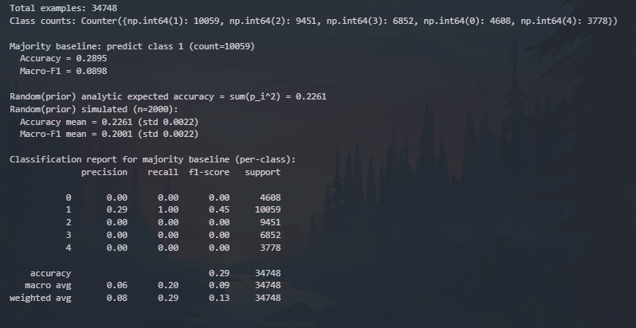
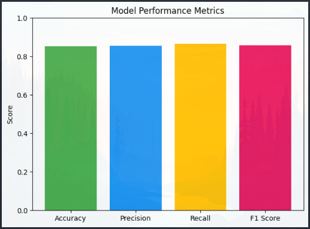
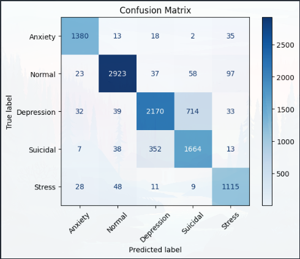
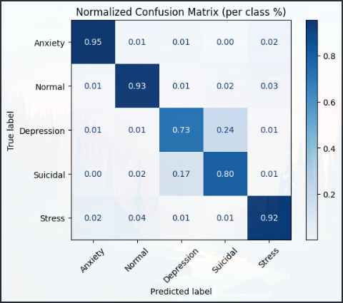

# Machine Learning Experiment Notes (NLP)

---

## Experiment 1

<details>
<summary><b>My Notes</b></summary>

- Best step: **5500**  
- F1 score peaked here → reliable improvement.  
- Should test longer training (beyond 9500) to confirm stability.  
- Min and max len are is weird because supposedly blank or null values should be dropped already.
- Model was still not evaluated using test set.
- In this model I did not override CrossEntropyLoss and default was used
- Focal loss is not used as well
- Slight errors were present in code 
```python
def tokenize_function(example):
    return tokenizer(example["text"], truncation=True, padding="max_length", max_length=256)

dataset_1_broad_emotion = dataset_2_specialize.map(tokenize_function, batched=True) # Should be re-assigned to itself
```
> The error should have no effect in the model because the variable name persisted in the actual training process/code.
</details>

---

**Date:** 2025-09-08  
**Model:** `xlm-roberta-base` (Pretrained)  

**Dataset:** `dataset_2_specialize - Sentiment-analysis-for-mental-health.csv`  
- Split: `train`, `validation`, `test`  
- Number of samples:  
  - Train: `31,248` 
  - Validation: `7,813`  
  - Test: `9,766`  
- Preprocessing:  
  - Min/Max text lengths: `0 - 31499`  
  - Removed rows: `Null and blank values "was removed"`  
  - Tokenization: `truncation=True, padding="max_length", max_length=256`  
  - Other transformations: `none`  

**Training Arguments:**  
```python
training_args = TrainingArguments(
    output_dir=MODEL_PATH_FINETUNE_2,

    # Evaluation & saving
    eval_strategy="steps",             # evaluate more frequently
    eval_steps=500,                    # evaluate every 500 steps
    save_strategy="steps",             # save every eval
    save_steps=500,
    save_total_limit=3,                # keep last 3 checkpoints

    # Optimizer
    learning_rate=2e-5,
    warmup_ratio=0.1,                  # 10% warmup               
    weight_decay=0.05,                 # helps reduce overfitting

    # Batch size
    per_device_train_batch_size=8,
    per_device_eval_batch_size=8,
    gradient_accumulation_steps=2,     # effective batch size 16

    # Mixed precision
    fp16=True,                         # faster training

    # Training length
    num_train_epochs=5,                # shorter to prevent overfitting
    load_best_model_at_end=True,       # load checkpoint with best validation loss
    metric_for_best_model="f1",  # choose metric to track best model

    # Misc
    dataloader_num_workers=4,
    # logging_steps=100,                 # logs every 100 steps
    # logging_dir=f"{MODEL_PATH_FINETUNE_1}/logs"
)
```
**Epoch/Steps Result**
| Step  | Training Loss | Validation Loss | Accuracy  | F1       |
|:-----:|--------------:|----------------:|----------:|---------:|
| 500   | 1.311300      | 0.819574        | 0.680916  | 0.538352 |
| 1000  | 0.683300      | 0.546934        | 0.778062  | 0.738692 |
| 1500  | 0.589200      | 0.586995        | 0.793037  | 0.760131 |
| 2000  | 0.540300      | 0.496498        | 0.806988  | 0.773157 |
| 2500  | 0.468100      | 0.479944        | 0.807372  | 0.776017 |
| 3000  | 0.460500      | 0.503425        | 0.803149  | 0.778765 |
| 3500  | 0.459600      | 0.478173        | 0.813772  | 0.791923 |
| 4000  | 0.435300      | 0.449684        | 0.822731  | 0.801370 |
| 4500  | 0.371900      | 0.484052        | 0.817228  | 0.795823 |
| **5000**  | **0.372400**      | **0.449487**    | **0.824267** | **0.805220✅** |
| 5500  | 0.374600      | 0.450858        | 0.831307  | 0.815609 |
| 6000  | 0.331700      | 0.483658        | 0.827723  | 0.814133 |
| 6500  | 0.298200      | 0.458722        | 0.831179  | 0.813803 |
| 7000  | 0.304000      | 0.503970        | 0.820044  | 0.807577 |
| 7500  | 0.292100      | 0.477838        | 0.830411  | 0.814774 |
| 8000  | 0.263500      | 0.493699        | 0.830539  | 0.815956 |
| 8500  | 0.230800      | 0.542825        | 0.829771  | 0.811218 |
| 9000  | 0.242800      | 0.512844        | 0.830027  | 0.814115 |
| 9500  | 0.242000      | 0.515752        | 0.830795  | 0.815644 |

---

## Experiment 2

<details>
<summary><b>My Notes</b></summary>

- Best F1 (0.8191)
- Highest accuracy (0.8318)
- Validation loss still reasonable (0.4667, not yet climbing too high)
- Training loss dropped consistently from 1.31 → 0.21.
- Validation loss decreased overall, though it fluctuated slightly after ~7500 steps (sign of early overfitting).
- Accuracy rose from 0.67 → 0.83.
- F1 improved significantly from 0.50 → 0.82, showing the model became much better at balancing precision and recall.
- After 8000 steps, validation loss started increasing while F1 plateaued, suggesting diminishing returns and possible overfitting.
- Training was successful: model has now also been tested using the test datase and reached strong performance (~83% accuracy, ~82% F1).
- Early stopping at ~7500 steps would likely give the best generalization.
- The model shows good convergence with no severe overfitting yet.
- In this experiment / training I have fixed the probelm with having blank or null values as well as code errors

</details>

---

**Date:** 2025-10-08  
**Model:** `xlm-roberta-base` (Pretrained)  

**Dataset:** `dataset_2_specialize - Sentiment-analysis-for-mental-health.csv`  
- Split: `train`, `validation`, `test`    
- Number of samples:  
  - Train: `31,248` 
  - Validation: `7,813`  
  - Test: `9,766`  
- Preprocessing:  
  - Min/Max text lengths: `0 - 31499`  
  - Removed rows: `Null and blank values "was removed"`  
  - Tokenization: `truncation=True, padding="max_length", max_length=256`  
  - Other transformations: `none`  

**Training Arguments:**  
```python
training_args = TrainingArguments(
    output_dir=MODEL_PATH_FINETUNE_2,

    # Evaluation & saving
    eval_strategy="steps",             # evaluate more frequently
    eval_steps=500,                    # evaluate every 500 steps
    save_strategy="steps",             # save every eval
    save_steps=500,
    save_total_limit=3,                # keep last 3 checkpoints

    # Optimizer
    learning_rate=2e-5,
    warmup_ratio=0.1,                  # 10% warmup               
    weight_decay=0.05,                 # helps reduce overfitting

    # Batch size
    per_device_train_batch_size=8,
    per_device_eval_batch_size=8,
    gradient_accumulation_steps=2,     # effective batch size 16

    # Mixed precision
    fp16=True,                         # faster training

    # Training length
    num_train_epochs=5,                # shorter to prevent overfitting
    load_best_model_at_end=True,       # load checkpoint with best validation loss
    metric_for_best_model="f1",  # choose metric to track best model

    # Misc
    dataloader_num_workers=4,
    # logging_steps=100,                 # logs every 100 steps
    # logging_dir=f"{MODEL_PATH_FINETUNE_1}/logs"
)
```
**Epoch/Steps Result**
| Step | Training Loss | Validation Loss | Accuracy | F1       |
|:----:|:-------------:|:---------------:|:--------:|:--------:|
| 500  | 1.308900      | 0.788243        | 0.677419 | 0.502172 |
| 1000 | 0.669300      | 0.553405        | 0.776242 | 0.741600 |
| 1500 | 0.574300      | 0.507243        | 0.789299 | 0.742081 |
| 2000 | 0.497300      | 0.523903        | 0.783794 | 0.771069 |
| 2500 | 0.449600      | 0.511158        | 0.799411 | 0.772949 |
| 3000 | 0.456100      | 0.491986        | 0.803507 | 0.784702 |
| 3500 | 0.446100      | 0.463267        | 0.818228 | 0.794589 |
| 4000 | 0.417300      | 0.456769        | 0.822965 | 0.808038 |
| 4500 | 0.361200      | 0.462819        | 0.818612 | 0.803590 |
| 5000 | 0.358900      | 0.464184        | 0.825909 | 0.811035 |
| 5500 | 0.349400      | 0.486290        | 0.819252 | 0.810147 |
| 6000 | 0.329500      | 0.458282        | 0.827061 | 0.811717 |
| 6500 | 0.290300      | 0.492683        | 0.823477 | 0.810141 |
| 7000 | 0.287000      | 0.489921        | 0.827061 | 0.813052 |
| **7500** | **0.277300** | **0.466702** | **0.831797** | **0.819070 ✅** |
| 8000 | 0.260000      | 0.527187        | 0.821173 | 0.812226 |
| 8500 | 0.231300      | 0.523386        | 0.827189 | 0.812374 |
| 9000 | 0.235200      | 0.529306        | 0.828853 | 0.813254 |
| 9500 | 0.215200      | 0.530631        | 0.828981 | 0.815462 |


---

## Experiment 3

<details>
<summary><b>My Notes</b></summary>

- Best F1 (0.8191)
- Highest accuracy (0.8318)
- Validation loss still reasonable (0.4667, not yet climbing too high)
- Training loss dropped consistently from 1.31 → 0.21.
- Validation loss decreased overall, though it fluctuated slightly after ~7500 steps (sign of early overfitting).
- Accuracy rose from 0.67 → 0.83.
- F1 improved significantly from 0.50 → 0.82, showing the model became much better at balancing precision and recall.
- After 8000 steps, validation loss started increasing while F1 plateaued, suggesting diminishing returns and possible overfitting.
- Training was successful: model has now also been tested using the test datase and reached strong performance (~83% accuracy, ~82% F1).
- Early stopping at ~7500 steps would likely give the best generalization.
- The model shows good convergence with no severe overfitting yet.
- In this experiment / training I have fixed the probelm with having blank or null values as well as code errors

</details>

---

**Date:** 2025-10-08  
**Model:** `xlm-roberta-base` (Pretrained)  

**Dataset:** `dataset_2_specialize - Sentiment-analysis-for-mental-health.csv`  
- Split: `train`, `validation`, `test`  
- Number of samples:  
  - Train: `31,248` 
  - Validation: `7,813`  
  - Test: `9,766`  
- Preprocessing:  
  - Min/Max text lengths: `0 - 31499`  
  - Removed rows: `Null and blank values "was removed"`  
  - Tokenization: `truncation=True, padding="max_length", max_length=256`  
  - Other transformations: `none`  

**Training Arguments:**  
```python
training_args = TrainingArguments(
    output_dir=MODEL_PATH_FINETUNE_2,

    # Evaluation & saving
    eval_strategy="steps",             # evaluate more frequently
    eval_steps=500,                    # evaluate every 500 steps
    save_strategy="steps",             # save every eval
    save_steps=500,
    save_total_limit=3,                # keep last 3 checkpoints

    # Optimizer
    learning_rate=2e-5,
    warmup_ratio=0.1,                  # 10% warmup               
    weight_decay=0.05,                 # helps reduce overfitting

    # Batch size
    per_device_train_batch_size=8,
    per_device_eval_batch_size=8,
    gradient_accumulation_steps=2,     # effective batch size 16

    # Mixed precision
    fp16=True,                         # faster training

    # Training length
    num_train_epochs=5,                # shorter to prevent overfitting
    load_best_model_at_end=True,       # load checkpoint with best validation loss
    metric_for_best_model="f1",  # choose metric to track best model

    # Misc
    dataloader_num_workers=4,
    # logging_steps=100,                 # logs every 100 steps
    # logging_dir=f"{MODEL_PATH_FINETUNE_1}/logs"
)
```
**Epoch/Steps Result**
| Step | Training Loss | Validation Loss | Accuracy | F1       |
|:----:|:-------------:|:---------------:|:--------:|:--------:|
| 500  | 1.308900      | 0.788243        | 0.677419 | 0.502172 |
| 1000 | 0.669300      | 0.553405        | 0.776242 | 0.741600 |
| 1500 | 0.574300      | 0.507243        | 0.789299 | 0.742081 |
| 2000 | 0.497300      | 0.523903        | 0.783794 | 0.771069 |
| 2500 | 0.449600      | 0.511158        | 0.799411 | 0.772949 |
| 3000 | 0.456100      | 0.491986        | 0.803507 | 0.784702 |
| 3500 | 0.446100      | 0.463267        | 0.818228 | 0.794589 |
| 4000 | 0.417300      | 0.456769        | 0.822965 | 0.808038 |
| 4500 | 0.361200      | 0.462819        | 0.818612 | 0.803590 |
| 5000 | 0.358900      | 0.464184        | 0.825909 | 0.811035 |
| 5500 | 0.349400      | 0.486290        | 0.819252 | 0.810147 |
| 6000 | 0.329500      | 0.458282        | 0.827061 | 0.811717 |
| 6500 | 0.290300      | 0.492683        | 0.823477 | 0.810141 |
| 7000 | 0.287000      | 0.489921        | 0.827061 | 0.813052 |
| **7500** | **0.277300** | **0.466702** | **0.831797** | **0.819070 ✅** |
| 8000 | 0.260000      | 0.527187        | 0.821173 | 0.812226 |
| 8500 | 0.231300      | 0.523386        | 0.827189 | 0.812374 |
| 9000 | 0.235200      | 0.529306        | 0.828853 | 0.813254 |
| 9500 | 0.215200      | 0.530631        | 0.828981 | 0.815462 |


---

## Experiment 4

> Note: This experiment is flawed due to the fact that the oversampling was done on all the dataset (train, validation, test). So there is a strong chance that a data leak has occured.

<details>
<summary><b>My Notes</b></summary>

- **General trend**  
  - Training loss steadily decreased from **1.61 → 0.49**.  
  - Validation loss dropped overall, stabilizing around **0.75–0.80**.  
  - Accuracy and F1 steadily increased throughout training.  

- **Key milestones**  
  - **Step 3000** → Accuracy ~0.50, F1 ~0.49 (model starting to beat random guessing).  
  - **Step 7500** → Accuracy ~0.67, F1 ~0.66 (solid mid-training performance).  
  - **Step 11000** → Accuracy ~0.74, F1 ~0.73 (big improvement, stable trend).  
  - **Step 15500** → Accuracy **0.77**, F1 **0.77** (best performance so far).  

- **Peak performance**  
  - Accuracy: **77.16%**  
  - F1: **76.94%**  
  - Step: **15500**  
  - Loss: Train ~**0.49**, Val ~**0.75** 

- **Pre-processing**  
  - Dataset minority class was oversampled in this experiment

</details>

---

**Date:** 2025-10-08  
**Model:** `xlm-roberta-base` (Pretrained)  

**Dataset:** `dataset_2_broad_emotion - tweet_emotions.csv`  
- Split: `train`, `validation`, `test`  
- Number of samples:  
  - Train: `50,349` 
  - Validation: `12,,588`  
  - Test: `15,735`  
- Preprocessing:  
  - Min/Max text lengths: `3 - 151`  
  - Removed rows: `Null and blank values "was removed"`  
  - Tokenization: `truncation=True, padding="max_length", max_length=256`  
  - Other transformations: `none`  

**Training Arguments:**  
```python
training_args = TrainingArguments(
    output_dir=MODEL_PATH_FINETUNE_2,

    # Evaluation & saving
    eval_strategy="steps",             # evaluate more frequently
    eval_steps=500,                    # evaluate every 500 steps
    save_strategy="steps",             # save every eval
    save_steps=500,
    save_total_limit=3,                # keep last 3 checkpoints

    # Optimizer
    learning_rate=2e-5,
    warmup_ratio=0.1,                  # 10% warmup               
    weight_decay=0.05,                 # helps reduce overfitting

    # Batch size
    per_device_train_batch_size=8,
    per_device_eval_batch_size=8,
    gradient_accumulation_steps=2,     # effective batch size 16

    # Mixed precision
    fp16=True,                         # faster training

    # Training length
    num_train_epochs=5,                # shorter to prevent overfitting
    load_best_model_at_end=True,       # load checkpoint with best validation loss
    metric_for_best_model="f1",  # choose metric to track best model

    # Misc
    dataloader_num_workers=4,
    # logging_steps=100,                 # logs every 100 steps
    # logging_dir=f"{MODEL_PATH_FINETUNE_1}/logs"
)
```
**Epoch/Steps Result**
| Step  | Training Loss | Validation Loss | Accuracy |    F1    |
|:-----:|:-------------:|:---------------:|:--------:|:--------:|
| 1000  | 1.613500      | 1.518490        | 0.386638 | 0.334158 |
| 1500  | 1.526100      | 1.481478        | 0.418653 | 0.393266 |
| 2000  | 1.500900      | 1.423291        | 0.454480 | 0.450465 |
| 2500  | 1.446600      | 1.371834        | 0.480060 | 0.468695 |
| 3000  | 1.399400      | 1.299659        | 0.505402 | 0.496338 |
| 3500  | 1.308200      | 1.294861        | 0.508500 | 0.496409 |
| 4000  | 1.225600      | 1.247362        | 0.535510 | 0.534584 |
| 4500  | 1.197100      | 1.144628        | 0.579997 | 0.575983 |
| 5000  | 1.153500      | 1.153187        | 0.584525 | 0.567715 |
| 5500  | 1.084800      | 1.057139        | 0.614871 | 0.607461 |
| 6000  | 1.075100      | 1.018775        | 0.629727 | 0.621237 |
| 6500  | 0.884800      | 1.038290        | 0.634573 | 0.631092 |
| 7000  | 0.883700      | 1.051622        | 0.639577 | 0.626146 |
| 7500  | 0.866300      | 0.923414        | 0.669685 | 0.664732 |
| 8000  | 0.847500      | 0.929995        | 0.680092 | 0.672827 |
| 8500  | 0.820400      | 0.891350        | 0.694868 | 0.690877 |
| 9000  | 0.825800      | 0.824314        | 0.710597 | 0.709007 |
| 9500  | 0.775300      | 0.858182        | 0.706943 | 0.707791 |
| 10000 | 0.666400      | 0.844161        | 0.725294 | 0.720832 |
| 10500 | 0.645700      | 0.804577        | 0.731967 | 0.728250 |
| 11000 | 0.629700      | 0.802877        | 0.739514 | 0.736722 |
| 11500 | 0.624400      | 0.806600        | 0.742215 | 0.737743 |
| 12000 | 0.627300      | 0.796153        | 0.734509 | 0.732538 |
| 12500 | 0.606200      | 0.763978        | 0.749206 | 0.745186 |
| 13000 | 0.530400      | 0.777910        | 0.761201 | 0.758064 |
| 13500 | 0.523700      | 0.757543        | 0.765253 | 0.762354 |
| 14000 | 0.500100      | 0.771883        | 0.765491 | 0.762726 |
| 14500 | 0.487300      | 0.760999        | 0.770257 | 0.767809 |
| 15000 | 0.491200      | 0.760953        | 0.767239 | 0.764089 |
| **15500** | **0.495200**     | **0.752773**        | **0.771608** | **0.769353** ✅ |

---

## Experiment 5

<details>
<summary><b>My Notes</b></summary>

- Used unbalanced dataset
- No oversampling was done
- Trainer used was normal (default)
- Model performed bad with only 48% accuracy and F-1 Score of 38%

</details>

---

**Date:** 2025-10-08  
**Model:** `xlm-roberta-base` (Pretrained)  

**Dataset:** `dataset_2_broad_emotion - tweet_emotions.csv`  
- Split: `train`, `validation`, `test`  
- Number of samples:  
  - Train: `25,596` 
  - Validation: `6,400`  
  - Test: `8,000`  
- Preprocessing:  
  - Min/Max text lengths: `3 - 151`  
  - Removed rows: `Null and blank values "was removed"`  
  - Tokenization: `truncation=True, padding="max_length", max_length=256`  
  - Other transformations: `none`  

**Training Arguments:**  
```python
training_args = TrainingArguments(
    output_dir=MODEL_PATH_FINETUNE_2,

    # Evaluation & saving
    eval_strategy="steps",             # evaluate more frequently
    eval_steps=500,                    # evaluate every 500 steps
    save_strategy="steps",             # save every eval
    save_steps=500,
    save_total_limit=3,                # keep last 3 checkpoints

    # Optimizer
    learning_rate=2e-5,
    warmup_ratio=0.1,                  # 10% warmup               
    weight_decay=0.05,                 # helps reduce overfitting

    # Batch size
    per_device_train_batch_size=8,
    per_device_eval_batch_size=8,
    gradient_accumulation_steps=2,     # effective batch size 16

    # Mixed precision
    fp16=True,                         # faster training

    # Training length
    num_train_epochs=5,                # shorter to prevent overfitting
    load_best_model_at_end=True,       # load checkpoint with best validation loss
    metric_for_best_model="f1",  # choose metric to track best model

    # Misc
    dataloader_num_workers=4,
    # logging_steps=100,                 # logs every 100 steps
    # logging_dir=f"{MODEL_PATH_FINETUNE_1}/logs"
)
```
**Epoch/Steps Result**
| Step | Training Loss | Validation Loss | Accuracy | F1       |
|:----:|:-------------:|:---------------:|:--------:|:--------:|
| 500  | 1.602900      | 1.415967        | 0.454219 | 0.263413 |
| 1000 | 1.427600      | 1.401772        | 0.472187 | 0.300180 |
| 1500 | 1.398600      | 1.357724        | 0.472969 | 0.286967 |
| 2000 | 1.341200      | 1.377093        | 0.467969 | 0.321229 |
| 2500 | 1.309700      | 1.343992        | 0.478438 | 0.354484 |
| 3000 | 1.311000      | 1.325892        | 0.496094 | 0.357454 |
| 3500 | 1.232900      | 1.381535        | 0.490156 | 0.365585 |
| 4000 | 1.231700      | 1.344173        | 0.491250 | 0.375893 |
| 4500 | 1.234100      | 1.352110        | 0.492500 | 0.377188 |
| 5000 | 1.174400      | 1.364862        | 0.490312 | 0.376701 |
| 5500 | 1.118800      | 1.394938        | 0.492031 | 0.376390 |
| 6000 | 1.133500      | 1.381920        | 0.488125 | 0.370647 |
| 6500 | 1.090800      | 1.416036        | 0.488750 | 0.382577 |
| 7000 | 1.047600      | 1.427585        | 0.486250 | 0.382788 |
| 7500 | 1.038500      | 1.432306        | 0.485781 | 0.387449 |
| 8000 | 1.023900      | 1.433498        | 0.485156 | 0.384731 |

---

## Experiment 6

<details>
<summary><b>My Notes</b></summary>

- Used unbalanced dataset
- No oversampling was done
- Trainer used was normal (default)
- Emotions were grouped into the following
  - Positive (happiness, fun, enthusiasm, relief, love)
  - Anxiety (worry)
  - Sadness (sadness, empty, boredom)
  - Anger (anger, hate)
  - Surprise (kept separate)
  - Neutral (baseline, later removed in final experiments).
- We removed Neutral, and Surprise in this dataset
- The model showed much more promising learning rate. Proving that Neutral or Surprise was introducing ambiguity to our model.
- Training loss steadily decreases, which means the model is learning.
- Validation loss initially decreases but then starts to increase after ~2500 steps → sign of overfitting.
- Accuracy grows from ~0.58 at step 500 to ~0.62 at 5000+.
- Gains are modest after 2500 steps.
- F1 improves significantly from 0.32 → 0.51.
- Best F1 = 0.5193 at step 5000, slightly higher than 5500.

</details>

---

**Date:** 2025-10-08  
**Model:** `xlm-roberta-base` (Pretrained)  

**Dataset:** `dataset_2_broad_emotion - tweet_emotions.csv`  
- Split: `train`, `validation`, `test`  
- Number of samples:  
  - Train: `18,671` 
  - Validation: `4,668`  
  - Test: `5,835`  
- Preprocessing:  
  - Min/Max text lengths: `3 - 151`  
  - Removed rows: `Null and blank values "was removed"`  
  - Tokenization: `truncation=True, padding="max_length", max_length=256`  
  - Other transformations: `none`  

**Training Arguments:**  
```python
training_args = TrainingArguments(
    output_dir=MODEL_PATH_FINETUNE_2,

    # Evaluation & saving
    eval_strategy="steps",             # evaluate more frequently
    eval_steps=500,                    # evaluate every 500 steps
    save_strategy="steps",             # save every eval
    save_steps=500,
    save_total_limit=3,                # keep last 3 checkpoints

    # Optimizer
    learning_rate=2e-5,
    warmup_ratio=0.1,                  # 10% warmup               
    weight_decay=0.05,                 # helps reduce overfitting

    # Batch size
    per_device_train_batch_size=8,
    per_device_eval_batch_size=8,
    gradient_accumulation_steps=2,     # effective batch size 16

    # Mixed precision
    fp16=True,                         # faster training

    # Training length
    num_train_epochs=5,                # shorter to prevent overfitting
    load_best_model_at_end=True,       # load checkpoint with best validation loss
    metric_for_best_model="f1",  # choose metric to track best model

    # Misc
    dataloader_num_workers=4,
    # logging_steps=100,                 # logs every 100 steps
    # logging_dir=f"{MODEL_PATH_FINETUNE_1}/logs"
)
```
**Epoch/Steps Result**
| Step | Training Loss | Validation Loss | Accuracy | F1       |
|:----:|:-------------:|:---------------:|:--------:|:--------:|
| 500  | 1.173900      | 0.976532        | 0.581620 | 0.327341 |
| 1000 | 0.999300      | 0.948569        | 0.601971 | 0.391213 |
| 1500 | 0.947500      | 0.943873        | 0.595973 | 0.432314 |
| 2000 | 0.926900      | 0.947065        | 0.599614 | 0.485828 |
| 2500 | 0.871800      | 0.924963        | 0.621894 | 0.509383 |
| 3000 | 0.825900      | 0.920582        | 0.619537 | 0.506657 |
| 3500 | 0.835100      | 0.922539        | 0.611825 | 0.513490 |
| 4000 | 0.750500      | 0.972919        | 0.606898 | 0.508385 |
| 4500 | 0.736900      | 0.979380        | 0.617181 | 0.516779 |
| **5000** | **0.693000** | **1.022871** | **0.617395** | **0.519307** ✅ |
| 5500 | 0.674700      | 1.026374        | 0.618252 | 0.516804 |

---

## Experiment 7

<details>
<summary><b>My Notes</b></summary>

- Used unbalanced dataset
- No oversampling was done
- Trainer used was normal (default)
- Model more conservative/stable
- Lower LR sacrifices F1/Accuracy but improves stability

</details>

---

**Date:** 2025-22-09  
**Model:** `xlm-roberta-base` (Pretrained)  

**Dataset:** `dataset_2_specialize - Sentiment-analysis-for-mental-health.csv`  
- Split: `train`, `validation`, `test`  
- Number of samples:  
  - Train: `25,596` 
  - Validation: `6,400`  
  - Test: `8,000`  
- Preprocessing:  
  - Min/Max text lengths: `3 - 151`  
  - Removed rows: `Null and blank values "was removed"`  
  - Tokenization: `truncation=True, padding="max_length", max_length=256`  
  - Other transformations: `none`  

**Training Arguments:**  
```python
training_args = TrainingArguments(
    output_dir=MODEL_PATH_FINETUNE_2,

    # Evaluation & saving
    eval_strategy="steps",             # evaluate more frequently
    eval_steps=500,                    # evaluate every 500 steps
    save_strategy="steps",             # save every eval
    save_steps=500,
    save_total_limit=3,                # keep last 3 checkpoints

    # Optimizer
    learning_rate=1e-5,
    warmup_ratio=0.1,                  # 10% warmup               
    weight_decay=0.05,                 # helps reduce overfitting

    # Batch size
    per_device_train_batch_size=8,
    per_device_eval_batch_size=8,
    gradient_accumulation_steps=2,     # effective batch size 16

    # Mixed precision
    fp16=True,                         # faster training

    # Training length
    num_train_epochs=5,                # shorter to prevent overfitting
    load_best_model_at_end=True,       # load checkpoint with best validation loss
    metric_for_best_model="f1",  # choose metric to track best model

    # Misc
    dataloader_num_workers=4,
    # logging_steps=100,                 # logs every 100 steps
    # logging_dir=f"{MODEL_PATH_FINETUNE_1}/logs"
)
```
**Epoch/Steps Result**
| Step | Training Loss | Validation Loss | Accuracy | F1       |
|:----:|:-------------:|:---------------:|:--------:|:--------:|
| 500  | 1.245400      | 0.870412        | 0.644265 | 0.433750 |
| 1000 | 0.756300      | 0.630176        | 0.758321 | 0.699784 |
| 1500 | 0.580600      | 0.528566        | 0.793011 | 0.751837 |
| 2000 | 0.508400      | 0.557222        | 0.770481 | 0.739935 |
| 2500 | 0.464900      | 0.500221        | 0.800051 | 0.773085 |
| 3000 | 0.454900      | 0.490921        | 0.800051 | 0.776570 |
| 3500 | 0.449400      | 0.468674        | 0.814516 | 0.789478 |
| 4000 | 0.424800      | 0.477303        | 0.816436 | 0.790677 |
| 4500 | 0.391600      | 0.475732        | 0.810932 | 0.792443 |
| 5000 | 0.383000      | 0.487995        | 0.812852 | 0.775383 |
| 5500 | 0.373700      | 0.481023        | 0.819764 | 0.797618 |
| 6000 | 0.357300      | 0.477357        | 0.816052 | 0.796043 |
| 6500 | 0.325200      | 0.507498        | 0.817588 | 0.796663 |
| 7000 | 0.336300      | 0.492060        | 0.822453 | 0.803753 |
| 7500 | 0.314900      | 0.480440        | 0.825141 | 0.802925 |
| 8000 | 0.318000      | 0.494568        | 0.818484 | 0.803484 |
| 8500 | 0.297000      | 0.486042        | 0.827829 | 0.806946 |
| 9000 | 0.284100      | 0.492883        | 0.824885 | 0.803023 |
| 9500 | 0.271300      | 0.494665        | 0.824245 | 0.803502 |

---

## Experiment 8

<details>
<summary><b>My Notes</b></summary>

- Used unbalanced dataset
- Up sampled Anxiety and Stress by sampling the class (4k rows) and paraphrased the rows using ChatGPT
- The sampled class was also made into taglish version for better tagalog language learning using ChatGPT
- Trainer used was normal (default)
- Best Accuracy: 0.8555 at step 9000
- Best F1: 0.8612 at step 9000
- Lowest Validation Loss: 0.3817 at step 5500
- Not the final experiment even if minimum accuracy was reached because the confusion matrix shows that the model is confused between `Depression` and `Suicidal`

</details>

---

**Date:** 2025-24-09  
**Model:** `xlm-roberta-base` (Pretrained)  

**Dataset:** `dataset_2_specialize - combined_cleaned_dataset.csv`  
- Split: `train`, `validation`, `test`  
- Number of samples:  
  - Train: `25,596` 
  - Validation: `6,400`  
  - Test: `8,000`  
- Preprocessing:  
  - Min/Max text lengths: `3 - 151`  
  - Removed rows: `Null and blank values "was removed"`  
  - Tokenization: `truncation=True, padding="max_length", max_length=512`  
  - Other transformations: `none`  

**Training Arguments:**  
```python
training_args = TrainingArguments(
    output_dir=MODEL_PATH_FINETUNE_2,

    # Evaluation & saving
    eval_strategy="steps",             # evaluate more frequently
    eval_steps=500,                    # evaluate every 500 steps
    save_strategy="steps",             # save every eval
    save_steps=500,
    save_total_limit=3,                # keep last 3 checkpoints

    # Optimizer
    learning_rate=2e-5,
    warmup_ratio=0.1,                  # 10% warmup               
    weight_decay=0.05,                 # helps reduce overfitting

    # Batch size
    per_device_train_batch_size=8,
    per_device_eval_batch_size=8,
    gradient_accumulation_steps=2,     # effective batch size 16

    # Mixed precision
    fp16=True,                         # faster training

    # Training length
    num_train_epochs=5,                # shorter to prevent overfitting
    load_best_model_at_end=True,       # load checkpoint with best validation loss
    metric_for_best_model="f1",  # choose metric to track best model

    # Misc
    dataloader_num_workers=4,
    # logging_steps=100,                 # logs every 100 steps
    # logging_dir=f"{MODEL_PATH_FINETUNE_1}/logs"
)
```
**Epoch/Steps Result**
| Step  | Training Loss | Validation Loss | Accuracy  | F1       |
|:-----:|:-------------:|:--------------:|:--------:|:--------:|
| 500   | 1.2956        | 0.8511         | 0.6418   | 0.5223   |
| 1000  | 0.6993        | 0.5240         | 0.7930   | 0.7899   |
| 1500  | 0.5400        | 0.5195         | 0.8061   | 0.8040   |
| 2000  | 0.4728        | 0.4927         | 0.8159   | 0.8180   |
| 2500  | 0.4564        | 0.4345         | 0.8233   | 0.8328   |
| 3000  | 0.4174        | 0.4299         | 0.8360   | 0.8376   |
| 3500  | 0.4154        | 0.4182         | 0.8375   | 0.8427   |
| 4000  | 0.3959        | 0.3996         | 0.8398   | 0.8460   |
| 4500  | 0.3692        | 0.4727         | 0.8322   | 0.8331   |
| 5000  | 0.3476        | 0.4118         | 0.8360   | 0.8464   |
| 5500  | 0.3357        | 0.3817         | 0.8494   | 0.8566   |
| 6000  | 0.3362        | 0.3898         | 0.8438   | 0.8495   |
| 6500  | 0.3237        | 0.3822         | 0.8493   | 0.8548   |
| 7000  | 0.2698        | 0.4156         | 0.8462   | 0.8540   |
| 7500  | 0.2788        | 0.4156         | 0.8470   | 0.8527   |
| 8000  | 0.2745        | 0.4245         | 0.8495   | 0.8581   |
| 8500  | 0.2760        | 0.3920         | 0.8478   | 0.8563   |
| **9000**  | 0.2326        | 0.4193         | **0.8555**   | **0.8612**   |

---

## Experiment 9

<details>
<summary><b>My Notes</b></summary>

- Up sampled Anxiety and Stress by sampling the class (4k rows) and paraphrased the rows using ChatGPT
- The sampled class was also made into taglish version for better tagalog language learning using ChatGPT
- We have taken the rows where the model was confused between Depression and Suicidal from the previous experiment and parphrased it as well as made it into a taglish version before concatenating it again to our dataset. This step will give the model a chance to learn more about how to separate Depression from suicidal.
- Trainer used was normal (default)
- Adding paraphrased “confused cases” seems to have helped the model learn the subtle distinctions, as F1 remains high despite some validation loss fluctuations.
- Small spikes in validation loss (e.g., 4500, 7000, 9500) are likely due to harder examples introduced in batches.
- Step 8000–9500 looks like a good compromise between accuracy and F1, though the lowest val loss occurs earlier at 6500.
- Not the final experiment even if minimum accuracy was reached because the confusion matrix shows that the model is still confused between `Depression` and `Suicidal`

</details>

---

**Date:** 2025-24-09  
**Model:** `xlm-roberta-base` (Pretrained)  

**Dataset:** `dataset_2_specialize - combined_cleaned_dataset_v2.csv`  
- Split: `train`, `validation`, `test`  
- Number of samples:  
  - Train: `25,596` 
  - Validation: `6,400`  
  - Test: `8,000`  
- Preprocessing:  
  - Min/Max text lengths: `3 - 151`  
  - Removed rows: `Null and blank values "was removed"`  
  - Tokenization: `truncation=True, padding="max_length", max_length=512`  
  - Other transformations: `none`  

**Training Arguments:**  
```python
training_args = TrainingArguments(
    output_dir=MODEL_PATH_FINETUNE_2,

    # Evaluation & saving
    eval_strategy="steps",             # evaluate more frequently
    eval_steps=500,                    # evaluate every 500 steps
    save_strategy="steps",             # save every eval
    save_steps=500,
    save_total_limit=3,                # keep last 3 checkpoints

    # Optimizer
    learning_rate=2e-5,
    warmup_ratio=0.1,                  # 10% warmup               
    weight_decay=0.05,                 # helps reduce overfitting

    # Batch size
    per_device_train_batch_size=8,
    per_device_eval_batch_size=8,
    gradient_accumulation_steps=2,     # effective batch size 16

    # Mixed precision
    fp16=True,                         # faster training

    # Training length
    num_train_epochs=5,                # shorter to prevent overfitting
    load_best_model_at_end=True,       # load checkpoint with best validation loss
    metric_for_best_model="f1",  # choose metric to track best model

    # Misc
    dataloader_num_workers=4,
    # logging_steps=100,                 # logs every 100 steps
    # logging_dir=f"{MODEL_PATH_FINETUNE_1}/logs"
)
```
**Epoch/Steps Result**
| Step   | Training Loss | Validation Loss | Accuracy  | F1       |
|:------:|:-------------:|:--------------:|:--------:|:--------:|
| 500    | 1.2901        | 0.8447         | 0.6755   | 0.6311   |
| 1000   | 0.6837        | 0.6380         | 0.7446   | 0.7495   |
| 1500   | 0.5478        | 0.5146         | 0.8011   | 0.8033   |
| 2000   | 0.4766        | 0.4875         | 0.8040   | 0.8107   |
| 2500   | 0.4388        | 0.5296         | 0.7942   | 0.8085   |
| 3000   | 0.4187        | 0.4231         | 0.8260   | 0.8359   |
| 3500   | 0.3951        | 0.4602         | 0.8279   | 0.8353   |
| 4000   | 0.3970        | 0.4136         | 0.8300   | 0.8365   |
| 4500   | 0.3746        | 0.4233         | 0.8364   | 0.8442   |
| 5000   | 0.3292        | 0.4131         | 0.8408   | 0.8492   |
| 5500   | 0.3237        | 0.4125         | 0.8347   | 0.8460   |
| 6000   | 0.3324        | 0.4246         | 0.8361   | 0.8423   |
| **6500**   | 0.3200        | **0.3905**         | 0.8444   | 0.8550   |
| 7000   | 0.2869        | 0.4426         | 0.8446   | 0.8500   |
| 7500   | 0.2551        | 0.4331         | 0.8457   | 0.8552   |
| **8000**   | 0.2768        | 0.4034         | **0.8509**   | **0.8582**   |
| 8500   | 0.2656        | 0.4213         | 0.8445   | 0.8521   |
| 9000   | 0.2551        | 0.4371         | 0.8501   | 0.8577   |
| 9500   | 0.2146        | 0.4652         | 0.8521   | 0.8599   |

---

## Experiment 10

<details>
<summary><b>My Notes</b></summary>

- Up sampled Anxiety and Stress by sampling the class (4k rows) and paraphrased the rows using ChatGPT
- The sampled class was also made into taglish version for better tagalog language learning using ChatGPT
- We have taken the rows where the model was confused between Depression and Suicidal from the previous experiment and parphrased it as well as made it into a taglish version before concatenating it again to our dataset. This step will give the model a chance to learn more about how to separate Depression from suicidal.
- Trainer used was weighted trainer
- Training loss decreases steadily from 1.370 → 0.211, showing good learning.
- Validation loss fluctuates between 0.389 → 0.457, but overall stays low, indicating the weighted trainer is helping with class imbalance.
- Lowest validation loss: 0.3838 at step 5000, which is slightly earlier than the best F1/accuracy steps.
- Accuracy improves from 62.09% → 84.90%, reaching the 85%+ target range in the later steps.
- F1 steadily increases from 0.600 → 0.857, showing the weighted trainer effectively improves performance on minority classes. 
- Weighted trainer stabilized F1 and accuracy on challenging classes (like distinguishing depression vs suicidal).
- This will be the first acceptable model. Even though in training it only reached 84% accuracy. During the test it reached 85% accross all metrics (accuracy, macro-f1, precision, recall)

</details>

---

**Date:** 2025-24-09  
**Model:** `xlm-roberta-base` (Pretrained)  

**Dataset:** `dataset_2_specialize - combined_cleaned_dataset_v3.csv`  
- Split: `train`, `validation`, `test`  
- Number of samples:  
  - Train: `25,596` 
  - Validation: `6,400`  
  - Test: `8,000`  
- Preprocessing:  
  - Min/Max text lengths: `3 - 151`  
  - Removed rows: `Null and blank values "was removed"`  
  - Tokenization: `truncation=True, padding="max_length", max_length=512`  
  - Other transformations: `none`  

**Training Arguments:**  
```python
training_args = TrainingArguments(
    output_dir=MODEL_PATH_FINETUNE_2,

    # Evaluation & saving
    eval_strategy="steps",             # evaluate more frequently
    eval_steps=500,                    # evaluate every 500 steps
    save_strategy="steps",             # save every eval
    save_steps=500,
    save_total_limit=3,                # keep last 3 checkpoints

    # Optimizer
    learning_rate=2e-5,
    warmup_ratio=0.1,                  # 10% warmup               
    weight_decay=0.05,                 # helps reduce overfitting

    # Batch size
    per_device_train_batch_size=8,
    per_device_eval_batch_size=8,
    gradient_accumulation_steps=2,     # effective batch size 16

    # Mixed precision
    fp16=True,                         # faster training

    # Training length
    num_train_epochs=5,                # shorter to prevent overfitting
    load_best_model_at_end=True,       # load checkpoint with best validation loss
    metric_for_best_model="f1",  # choose metric to track best model

    # Misc
    dataloader_num_workers=4,
    # logging_steps=100,                 # logs every 100 steps
    # logging_dir=f"{MODEL_PATH_FINETUNE_1}/logs"
)
```
**Epoch/Steps Result**
| Step    | Training Loss | Validation Loss | Accuracy  | F1       |
|:-------:|:-------------:|:--------------:|:--------:|:--------:|
| 500     | 1.3698        | 0.9145         | 0.6209   | 0.6005   |
| 1000    | 0.7304        | 0.6278         | 0.7460   | 0.7564   |
| 1500    | 0.5534        | 0.4817         | 0.7898   | 0.7994   |
| 2000    | 0.4997        | 0.5185         | 0.7612   | 0.7768   |
| 2500    | 0.4469        | 0.4311         | 0.8262   | 0.8261   |
| 3000    | 0.4046        | 0.4154         | 0.8318   | 0.8366   |
| 3500    | 0.3932        | 0.4051         | 0.8202   | 0.8281   |
| 4000    | 0.4098        | 0.3925         | 0.8366   | 0.8394   |
| 4500    | 0.3803        | 0.3896         | 0.8446   | 0.8496   |
| **5000**    | 0.3212        | **0.3838**         | 0.8454   | 0.8509   |
| 5500    | 0.3328        | 0.4161         | 0.8407   | 0.8476   |
| 6000    | 0.3219        | 0.3886         | 0.8408   | 0.8435   |
| **6500**    | 0.3211        | 0.3866         | **0.8485**   | 0.8534   |
| 7000    | 0.2628        | 0.4247         | 0.8455   | 0.8481   |
| 7500    | 0.2542        | 0.4358         | 0.8474   | 0.8521   |
| 8000    | 0.2558        | 0.4116         | 0.8481   | 0.8549   |
| 8500    | 0.2677        | 0.3944         | 0.8468   | 0.8542   |
| 9000    | 0.2334        | 0.4227         | 0.8493   | **0.8570**   |
| 9500    | 0.1974        | 0.4513         | 0.8470   | 0.8553   |
| 10000   | 0.2108        | 0.4570         | 0.8490   | 0.8569   |

### **Dataset Baseline**


### **Classification Metrics**
- **Accuracy**:  0.8520
- **F1 Score**:  0.8588
- **Recall**:    0.8668
- **Precision**: 0.8549



### **Confusion Matrix**

